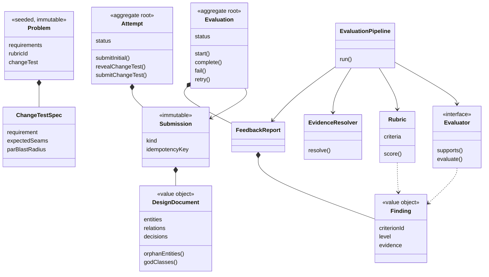

# Design note

*The MVP, the domain model, the evaluation approach, and what I traded away.*

## The MVP in one paragraph

A learner picks one of four problems, fills a structured design document, and submits it. The submission is stored, then evaluated out of band by a pipeline of independent evaluators. They get a rubric report where every criterion says which evaluator produced it and every criticism cites a class they actually wrote. Then a requirement they have not seen arrives, they mark which of their classes it forces open, and the platform measures the blast radius. History shows each criterion's trend across attempts and names the one they keep getting wrong.

## User flow

```
/problems  ->  /attempt/:id        ->  /attempt/:id/report  ->  /attempt/:id/change-test
   pick        structured canvas       rubric + evidence        the hidden requirement
               live class diagram      per-criterion source     blast radius vs par
                                                                       |
                                                                 /history
                                                          trend + recurring weakness
```

Four states, held on the `Attempt` aggregate itself: `DRAFTING -> SUBMITTED -> CHANGE_TEST -> COMPLETE`. Making that explicit is what lets every page route on one field instead of inferring where the learner is from whichever objects happen to be non-null.

## The submission format, and why it is not code or prose

The learner fills a **structured design document**: assumptions, classes with a stereotype and a stated responsibility, typed relationships, and decisions carrying a rejected alternative.

Free prose was rejected because nothing about it is checkable. Code was rejected because it costs an editor, a runner, a sandbox, and a language choice, and most of what it proves about *design* is already visible in the structure.

Structure buys three things:

1. **Deterministic checks become possible at all.** Orphan classes, dangling relationships, classes with no stated responsibility and requirements with no home are computable from this shape and not from a paragraph.
2. **Consistent input is the biggest lever on consistent output.** Feeding a model the same shape every time removes most of the run-to-run variance that makes LLM scoring useless.
3. **The form teaches.** Being asked for `alternativeRejected` on every decision is itself the lesson: a decision with nothing rejected is usually a default nobody examined.

The payoff is the answer to the brief's Change Test A. **A class diagram is this same data with a different renderer.** `DesignDocument` is the canonical model, and `MermaidEmitter` draws it. Accepting an uploaded diagram later means writing one `DesignDocumentParser` implementation and changing nothing else, because no evaluator, rubric, or view knows where the document came from. The live diagram on the canvas is the proof: it is generated from the exact object the evaluators read.

## Domain model

Everything in `src/domain/` imports nothing from React, Next.js, or SQLite. It is unit-tested with no mocks except a fake `LlmClient`.



### What each thing owns

| Class | Owns | Depends on |
| --- | --- | --- |
| `Problem` | The brief, and the hidden change test with its seams and par | Nothing |
| `DesignDocument` | What the learner designed, plus every structural question about it | Nothing |
| `Attempt` | Where in the loop this attempt is, and refusing transitions that skip a step | `DesignDocument` |
| `Evaluation` | The lifecycle of one evaluation run and its retry budget | `FeedbackReport` |
| `Evaluator` | One way of forming an opinion. An interface, four implementations | Its own inputs only |
| `EvaluationPipeline` | Running evaluators, surviving one failing, assembling the report | `Evaluator`, `Rubric`, `EvidenceResolver` |
| `Rubric` | The criteria, their level descriptors, and deterministic aggregation | `Finding` |
| `EvidenceResolver` | Throwing away findings that cite classes that do not exist | `DesignDocument` |

### Patterns, and why each one is there

Every abstraction below answers a change I can name. Anything I could not name a change for is not in the model.

| Pattern | Where | The change it absorbs |
| --- | --- | --- |
| Strategy | `Evaluator` | Adding a rule-based checker, human review, or a test runner. This is Change Test B, and the answer is one new class in one array in `container.ts` |
| Strategy | `DesignDocumentParser` | Accepting a diagram or source file instead of the form. This is Change Test A |
| Pipeline | `EvaluationPipeline` | Composing evaluators, and degrading rather than failing when one dies |
| State | `Attempt`, `Evaluation` | The practice loop and the async lifecycle, with illegal transitions throwing |
| Repository | `*Repository` | Local SQLite file and hosted SQLite behind one interface; in-memory in tests |
| Value object | `DesignDocument`, `Finding`, `EvidenceRef` | Immutability where identity would be meaningless |

There is no dependency-injection container, no event bus, and no CQRS. Constructor injection by hand in one composition root is enough at this size, and the alternatives would have been pattern-flexing.

## Evaluation approach

### The rubric

Six criteria, four ordinal levels each. Every level is written as an **observable behaviour**, because the research on LLM-as-judge reliability is unambiguous that adjectives let a grader improvise, and because a learner cannot act on "mostly clear".

The difference this makes, from `lldV1.ts`:

> **L2, Responsibility Clarity** — Every class states a responsibility and no class owns more than one reason to change.
>
> **L3** — As L2, and behaviour sits with the data it operates on rather than in a separate manager class.

Two readers can agree on those. They can also be checked against the submission.

### Which parts are deterministic, and which are not

Answered per criterion rather than globally, and shown in the UI on every criterion so the learner never has to guess.

| Criterion | Weight | Owner | Why |
| --- | --- | --- | --- |
| Requirement coverage | 15 | Counted | Whether a requirement has a home is countable |
| Responsibility clarity | 20 | Claude | Judging whether two stated responsibilities are one job needs reading |
| Abstraction & interfaces | 20 | Claude | Counting interfaces is easy and meaningless; judging whether one has a second plausible implementation is not |
| Coupling & cohesion | 15 | Claude | Relation counts are a weak signal; whether a dependency points the right way is judgement |
| **Extensibility** | 20 | **Counted** | Run the change and count what had to move |
| Reasoning quality | 10 | Claude | Telling a real trade-off from a restated fact requires reading the argument |

A criterion's owner is enforced, not advisory: `Rubric.score` will not let a model's verdict decide a criterion it does not own. An LLM cannot talk its way into a better requirement-coverage score.

### The four evaluators

1. **`StructureEvaluator`** — deterministic, sub-millisecond, always runs. Owns requirement coverage; raises supporting observations elsewhere. The learner has feedback before the model has finished its first token.
2. **`LlmRubricEvaluator`** — Claude Sonnet, temperature 0, output constrained by a tool schema rather than parsed from prose. Given the rubric's own descriptors verbatim, so it is choosing between anchors, not inventing a scale.
3. **`HeuristicRubricEvaluator`** — stands in when no API key is configured. Not canned text: it derives levels from measurable properties of the submitted document, so bad designs still score badly. Labelled `HEURISTIC` everywhere it appears, and the rubric only lets it fill a slot its real owner left empty.
4. **`BlastRadiusEvaluator`** — the change test. Mostly arithmetic. The model's only job here is auditing one specific claim: classes marked as needing no change that plainly do.

### Feedback has to point at something

Every `Finding` carries `EvidenceRef`s, and `EvidenceResolver` drops any finding whose evidence does not resolve to a real id in the submission. Partly-grounded findings survive with the invented references stripped; a finding whose evidence is entirely invented is discarded and counted in the report footer.

This is not theoretical tidiness. The model cited a `PaymentProcessor` that did not exist. Adding a line to the prompt reduced it and did not stop it. A prompt expresses a preference; a validator gives a guarantee.

In the UI, hovering an evidence chip highlights that class in the diagram. Feedback you can check beats feedback you have to trust.

### Blast radius

```
radius = (modified + added) / (originalClasses + added)
```

Banded against the problem's own `parBlastRadius`, because absorbing a pricing change and absorbing a scheduling change do not cost the same even in a well-factored design.

Two guards matter. New classes count toward the denominator *and* the numerator, so answering "I'd add ten classes" is not free. And a learner who marks everything untouched scores `L0`, not a perfect zero — a requirement that costs nothing was not modelled, it was ignored.

Alongside the number, a **seam check**: did the original design have anywhere sensible to put this concern? Seams name a *concern*, never a class, because naming the expected class would smuggle in a reference solution. Matching is against class names and method names rather than the prose responsibility, which I changed after watching `ParkingLot` count as the seam for spot types purely because its description mentioned spots.

## Reliability

Kept small, as the brief asks.

- Submit writes the submission and a `QUEUED` evaluation, then returns `202` with an id. The request never waits on a model.
- **Idempotency** is a `UNIQUE (attempt_id, idempotency_key)` constraint. Scoped to the attempt, not global: a client reusing a key across two attempts is making two different requests, and an unscoped key would have silently handed the second one the first one's report. I found that by walking the flow with a fixed key.
- An in-process worker moves `QUEUED -> RUNNING -> COMPLETED | FAILED`, capped at three attempts. No Redis, no broker, no second process.
- The status endpoint starts the pump if it finds queued work, which makes the system self-healing after a restart.
- Evaluators run under `Promise.allSettled`. One failing evaluator yields a **degraded report** carrying whatever succeeded, with the missing criteria marked not assessed rather than scored zero.
- A failed evaluation offers Retry, wired to the same idempotent path.

**If this grew:** the first thing to separate is the evaluation worker. It is the only slow, bursty, failure-prone part, and `EvaluationRepository` already isolates it — the pump would become a process reading the same table, and nothing in the domain would change. Everything else can stay one monolith for a long time.

## Trade-offs I made, and what they cost

| Decision | Bought | Cost |
| --- | --- | --- |
| Structured form, not code | Deterministic checks, consistent model input, a free diagram | No evidence about naming, testability, or whether it compiles |
| Seams named as concerns, not classes | No smuggled reference solution | Keyword-and-stereotype matching is blunt, and marked as such in the code |
| Learner self-reports impact | Blast radius computable without running anything | Depends on honest tagging, which is why the model audits it |
| Score only assessed criteria | A first report is not penalised for a round not yet reached | A degraded report scores over less of the rubric, so `coverage` is always shown |
| One in-process worker | No infrastructure | `claimNextQueued` is a plain read; a second worker would need a real claim |
| No accounts | No login flow to build or review | Single learner; every repository is already keyed by learner id |

## What I would do next

1. **Calibrate the rubric.** Score twenty known-good and known-bad designs and check the levels land where a human would put them. Right now the descriptors are argued for, not measured.
2. **Ask the model to map seams to classes** and intersect with the keyword match, replacing the blunt part of the change test.
3. **Cross-attempt feedback.** The history page finds a recurring weakness; the report does not yet know about it. "This is the third attempt where decisions had no rejected alternative" is worth more than any single score.
